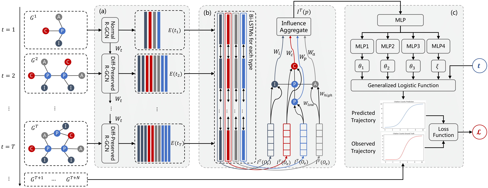

# CPIR

- This is the implementation of our paper "Citation Prediction via Influence Representation Using Temporal Graphs".
- This is the repository for reproducing the results in the paper.


## Prerequisites

- We test the code in both MacOS Monterey and Window 10 operating systems.
- Anaconda 3 with Python 3.9 should be firstly installed.
- The requirements and how to setup the environment with Conda is listed in the file `requirements.txt`.
- You need to download the data files into a folder named "data" and put it into the same folder with code.

## dataset
- You can access the dataset used in this work from our following Google Drive links:
- [AIPatent](https://drive.google.com/drive/folders/1Clu05o7uUcAmGFeQPZGFaN1hkQWq0pNe?usp=sharing) is our own contributed dataset using global patents from artificial intelligence fields.
- [APS](https://drive.google.com/drive/folders/1rUW8_cW-ogfXelj44k5Rv019molCj2Ww?usp=sharing) (Original from [APS](https://journals.aps.org/datasets)) is an open acdemic paper dataset from physics fields.

## Commands to run

### The input arguments:

- data_dir: The directory path of the datasets. For example, ../data/AIPatent or ../data/APS
- start_year: The start year the framework need to predict from. For example, 2012 or 2000
- predict_year: The Nth year the framework need to predict. For example, 9 or 3 (default 0 to predict all future years)
- time_steps_history: Using N history snapshots for feature extraction. For example, 10 or 5
- time_steps_predict: To output a sequence of citation numbers with length N. For example, 10 or 5
- emb_mode: The model to be used as the embedding module for feature extraction. Options are rgcn/rgcn-hist.
- impute_mode: The model to be used as the imputation module for feature aggregation. Options are static/hdgnn/dynamic/...
- ts_mode: The model to be used as the time-series prediction module for sequence generation. Options are log/logistic/linear/...
- subtask: The type of subtask to conduct. Options are mix/newborn/grown
- epochs: The number of epoches to train. For example, 20
- batch_size: The batch size of train and test. For example, 512
- num_layer: The number of layers the embedding model uses. For example, 2
- hidden_size: The size of hidden layer the embedding model uses. For example, 64
- graph_emb_size: The size of embeddings output from the graph feature extraction module. For example, 128
- influence_emb_size: The size of embeddings output from the influence representation module. For example, 128
- lr: The learning rate of the model. For example, 0.01
- dropout: The dropout used in the feature extraction module. For example, 0.5
- use_cuda: Whether use GPU or CPU. For example, True

### Some examples:

- Train CPIR framework with APS dataset on the Mixed subtask to predict the citation counts in the next 5 years:
```
python main.py --data_dir ../data/APS --start_year 2000 --time_steps_history 5 --time_steps_predict 5 --use_cuda --emb_mode rgcn-hist --impute_mode dynamic --ts_mode logistic --subtask mix --lr 0.01 --batch_size 512 --loss_func RMLSE --epochs 20
```

- Train TGNN framework with AIPatent dataset on the Newborn subtask to predict the citation counts in the next 10 years:
```
python main.py --data_dir ../data/AIPatent --start_year 2012 --time_steps_history 10 --time_steps_predict 10 --use_cuda --emb_mode rgcn --impute_mode no --ts_mode linear --subtask newborn --lr 0.01 --batch_size 512 --loss_func RMLSE --epochs 20
```

- Train HINTS framework with APS dataset on the Grown subtask to predict the citation counts in the next 5 years:
```
python main.py --data_dir ../data/APS --start_year 2000 --time_steps_history 5 --time_steps_predict 5 --use_cuda --emb_mode rgcn --impute_mode static --ts_mode hist-log --subtask grown --lr 0.01 --batch_size 512 --loss_func RMLSE --epochs 20
```

- Train HDGNN framework with AIPatent dataset on the Mixed subtask to predict the citation counts in the next 10 years:
```
python main.py --data_dir ../data/AIPatent --start_year 2012 --time_steps_history 10 --time_steps_predict 10 --use_cuda --emb_mode rgcn --impute_mode hdgnn --ts_mode linear --subtask mix --lr 0.01 --batch_size 512 --loss_func RMLSE --epochs 20
```

- Train CPIR framework with AIPatent dataset on the Mixed subtask to predict the citation counts at the 8th year:
```
python main.py --data_dir ../data/AIPatent --start_year 2012 --predict_year 8 --time_steps_history 10 --time_steps_predict 10 --use_cuda --emb_mode rgcn-hist --impute_mode dynamic --ts_mode logistic --subtask mix --lr 0.01 --batch_size 512 --loss_func RMLSE --epochs 20
```

- Train CPIR-logistic framework with AIPatent dataset on the Mixed subtask to predict the citation counts in the next 10 years:
```
python main.py --data_dir ../data/AIPatent --start_year 2012 --time_steps_history 10 --time_steps_predict 10 --use_cuda --emb_mode rgcn-hist --impute_mode dynamic --ts_mode log --subtask mix --lr 0.01 --batch_size 512 --loss_func RMLSE --epochs 20
```

## Contact 
Chang Zong zongchang@zju.edu.cn

